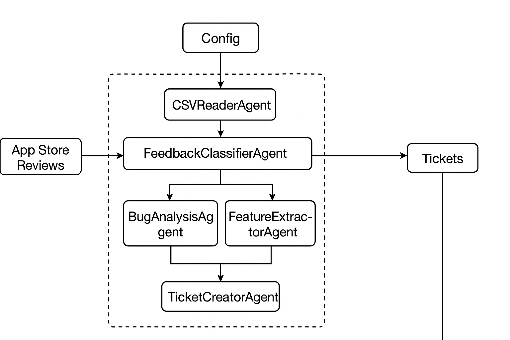

# Intelligent User Feedback Analysis and Action 
##Business Problem 
Modern SaaS and app-based companies receive dozens of reviews and other user feedback every day from multiple channels, including app stores such as Google Play and the Apple App Store, customer support emails, and user surveys. Manual triage is slow, inconsistent, and not scalable, leading to missed critical bugs, delayed feature requests, and uneven prioritization across teams.

# AutoGen + Gemini Feedback System

Multi-agent pipeline using **AutoGen** for orchestration and **Google Gemini** for the core reasoning.
Gracefully falls back to deterministic rules if `GEMINI_API_KEY` is not set.

## Features
- Agents: CSVReader, FeedbackClassifier, BugAnalysis, FeatureExtractor, TicketCreator, QualityCritic, Logger
- Gemini-powered classification, extraction, ticket composition, and critique
- Deterministic fallback rules keep it runnable offline
- Streamlit UI for monitoring & manual overrides
- Traceability via `source_id` and CSV logs

## Setup
```bash
1) Put `app_store_reviews.csv` (you already have one) next to these files.
2) Install: `pip install -r requirements.txt`
3) Set key: `export GEMINI_API_KEY="your-key"`
4) Run: `python autogen_pipeline.py` 
5) Open UI: `streamlit run streamlit_ui.py`


You’re set. If you also want me to include **support_emails.csv** and **expected_classifications.csv** generators (matching your capstone spec), say the word and I’ll drop them in as extra scripts.   
